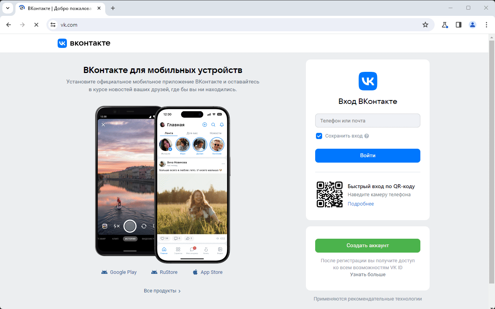
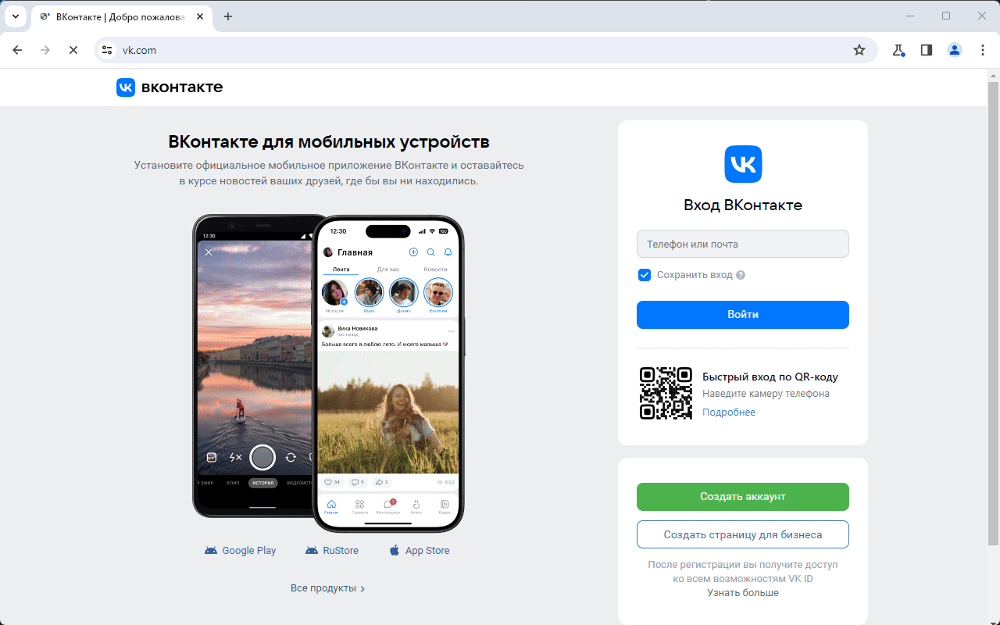

# Пишем автотесты для vk.com на Playwright

Данный репозиторий содержит исходный код, который используется в статье `"Playwright & TypeScript: Быстрый старт в автоматизации тестирования"`.

## Скриншоты

### Тест #1


### Тест #2



## Локальный запуск

Клонируйте данный репозиторий

```bash
git clone https://github.com/suprunchuk/playwright-demo-vkcom
```
Установите зависимости

```bash
cd playwright-demo-vkcom && npm i
```
Запустите тесты для vk.com

```bash
npx playwright test vk.spec.ts --headed
```


## Documentation

[Playwright Docs](https://playwright.dev/docs/intro)

## License

[MIT](https://github.com/suprunchuk/playwright-demo-vkcom/blob/main/LICENSE)


## Authors

- [@suprunchuk](https://www.github.com/suprunchuk)

